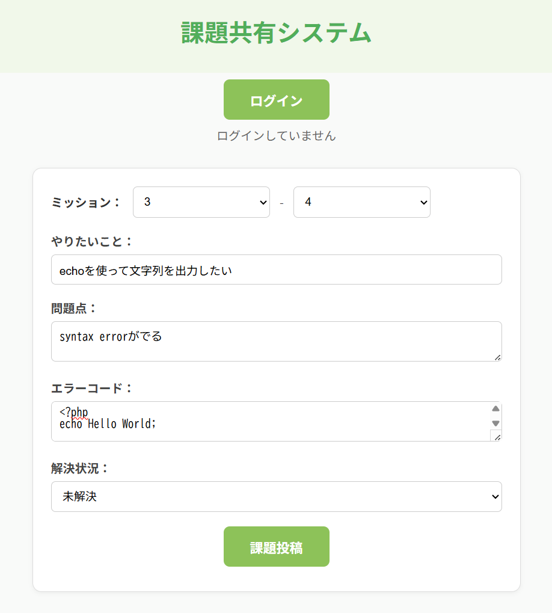
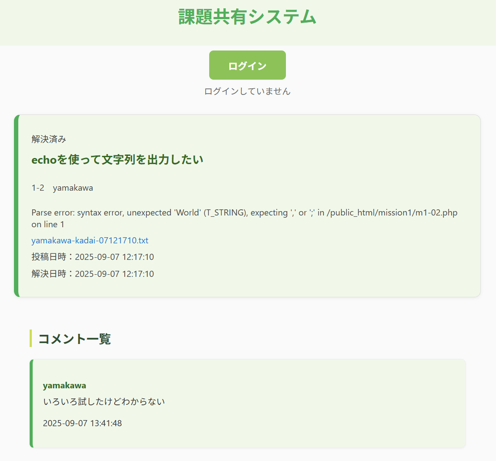

# 課題共有システム

チーム学習で発生する「課題やエラーを共有し、解決を助け合う」ための Web アプリケーションです。

自分で企画・設計・実装した成果物であり、ポートフォリオとして公開しています。

---

## 📌 機能概要
- ユーザー登録 / ログイン / ログアウト
- 課題の投稿
  - ミッションの分類（大分類・小分類）
  - 実装したいこと
  - 問題点
  - エラーファイルの記録
  - 解決状況（未解決・解決済み）の管理
- コメントの投稿
  - 似た問題を抱える人からの「共感」
  - 既に克服した/解決策のわかる人からの「解決策」
- 課題詳細ページでの閲覧
- 課題一覧表示

---

## 🛠 技術スタック
- **バックエンド**: PHP 8.3.25
- **データベース**: MySQL 8.0.42
- **フロントエンド**: HTML / CSS / JavaScript
- **環境**: VSCode, PHP 内蔵サーバー (または XAMPP/MAMP)

---

## 📂 ディレクトリ構成
```
kadai-share-system/
├─ public/                 # 公開ディレクトリ (フロント側)
│   ├─ api/                # サーバーサイドの API エンドポイント (PHP)
│   ├─ pages/              # 静的ページ用の HTML
│   ├─ css/                # ページデザイン用の CSS
│   ├─ js/                 # フロントの動的制御・API呼び出し
│   │   ├─ clients/        # API 通信用モジュール (fetch など)
│   │   ├─ services/       # ビジネスロジックをまとめた処理関数
│   │   ├─ components/     # UI コンポーネント (ボタン, カード等)
│   │   └─ pages/          # ページ単位のスクリプト (画面構築)
│   └─ favicon.ico         # ファビコン
├─ models/                 # データベース操作 (SQL実行, CRUD)
├─ includes/               # 汎用関数や共通処理 (DB接続, バリデーション等)
├─ uploads/                # ユーザーがアップロードしたファイル保存先
│   ├─ kadais/             # 課題投稿時のエラーファイル
│   └─ comments/           # コメント投稿時の添付ファイル
├─ docs/                   # README.md 用の資料・スクリーンショット
├─ init.sql                # DB 初期化用 SQL スクリプト
├─ db.sample.php           # DB 接続サンプル (本番用 db.php は .gitignore 済)
├─ README.md               # プロジェクト説明ファイル
└─ .gitignore              # Git 管理から除外するファイル一覧
```

---

## 🚀 セットアップ方法

1. **リポジトリをクローン**
   ```bash
   git clone https://github.com/futa55555/kadai-share-system.git
   cd kadai-share-system
   ```

2. **データベース作成**
   ```bash
   mysql -u root -p < init.sql
   ```

3. **DB接続設定**
   - `db.sample.php` をコピーして `db.php` を作成
   - 自分の環境に合わせて DSN / ユーザー名 / パスワードを修正
   ```php
   $dsn = 'mysql:host=localhost;dbname=your_db;charset=utf8mb4';
   $user = 'your_username';
   $password = 'your_password';
   ```

4. **サーバー起動**
   - XAMPP/MAMP または PHP 内蔵サーバーを利用
   ```bash
   php -S localhost:8000 -t public
   ```

5. **ブラウザでアクセス**
   ```
   http://localhost:8000/pages/index.html
   ```

---

## 📸 スクリーンショット

### 課題投稿画面


### 課題詳細画面


---

## 💡 今後の改善予定
- 画像投稿でエラー状況を共有する仕組みの導入
- フロントエンド強化（React, TypeScript）

---

## 👤 作者
- **名前**: Futa Yamakawa (山川楓太)
- **所属**: 東京大学大学院 工学系研究科 原子力国際専攻
- **役割**: 企画 / 設計 / 実装を全て個人で担当
- **目的**: チーム学習のサポート、およびWebアプリ開発の経験向上

---

## ⚠️ 注意
- `db.php` など機密情報を含むファイルは `.gitignore` で除外済みです
- 実運用向けではなく、学習・ポートフォリオ目的で公開しています
