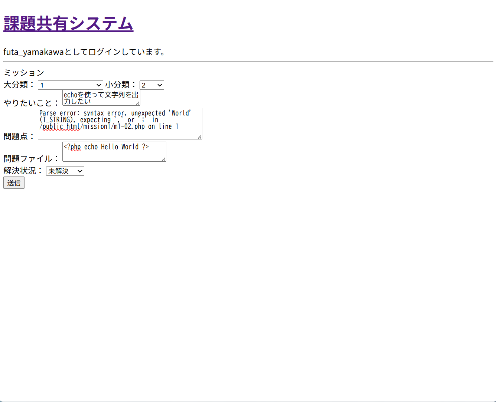
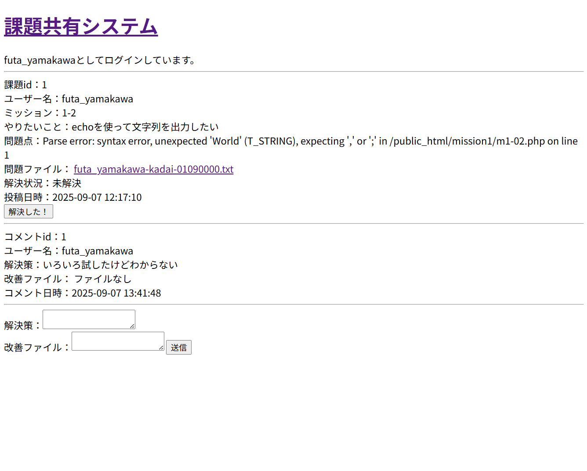

# 課題共有システム

大学のチーム学習で発生する「課題やエラーを共有し、解決を助け合う」ための Web アプリケーションです。  
自分で企画・設計・実装した成果物であり、ポートフォリオとして公開しています。

---

## 📌 機能概要
- ユーザー登録 / ログイン / ログアウト
- 課題の投稿
  - ミッションの分類（大分類・小分類）
  - やりたいこと / 問題点 / エラーファイルの記録
  - 解決状況（未解決・解決済み）の管理
- コメント機能
  - 解決策や改善ファイルを添付して議論できる
- 課題詳細ページでの閲覧
- 課題一覧表示

---

## 🛠 技術スタック
- **バックエンド**: PHP 8.x
- **データベース**: MySQL 8.x
- **フロントエンド**: HTML / CSS / JavaScript
- **環境**: ローカル環境（XAMPP/MAMP）または さくらレンタルサーバー

---

## 📂 ディレクトリ構成
```
課題共有システム/
├─ public/                # 公開ディレクトリ
│   ├─ index.php          # 課題一覧ページ
│   ├─ kadai_post.php     # 課題投稿ページ
│   ├─ kadai_detail.php   # 課題詳細ページ
│   ├─ sign_up.php        # サインアップ
│   ├─ log_in.php         # ログイン
│   ├─ log_out.php        # ログアウト
│   └─ show_table.php     # DB内容確認（開発用）
├─ init.sql               # DB初期化用SQL
├─ db.sample.php          # DB接続サンプル（db.php は .gitignore 済）
├─ README.md
└─ .gitignore
```

---

## 🚀 セットアップ方法

1. **リポジトリをクローン**
   ```bash
   git clone https://github.com/yourname/kadai-share-system.git
   cd kadai-share-system
   ```

2. **データベース作成**
   ```bash
   mysql -u root -p < init.sql
   ```

3. **DB接続設定**
   - `db.sample.php` をコピーして `db.php` を作成
   - 自分の環境に合わせて DSN / ユーザー名 / パスワードを修正
   ```php
   $dsn = 'mysql:host=localhost;dbname=your_db;charset=utf8mb4';
   $user = 'your_username';
   $password = 'your_password';
   ```

4. **サーバー起動**
   - XAMPP/MAMP または PHP 内蔵サーバーを利用
   ```bash
   php -S localhost:8000 -t public
   ```

5. **ブラウザでアクセス**
   ```
   http://localhost:8000/index.php
   ```

---

## 📸 スクリーンショット

### 課題投稿画面


### 課題詳細画面


---

## 💡 今後の改善予定
- バリデーション強化（未入力チェックや文字数制限など）
- ファイルアップロード機能の改善
- デザイン改善（CSSフレームワーク導入）
- Ajax を使った動的更新

---

## 👤 作者
- **名前**: Futa Yamakawa (山川楓太)  
- **所属**: 東京大学大学院 工学系研究科 原子力国際専攻  
- **役割**: 企画 / 設計 / 実装を全て個人で担当  
- **目的**: 就職活動におけるポートフォリオ、および学習記録  

---

## ⚠️ 注意
- `db.php` など機密情報を含むファイルは `.gitignore` で除外済みです  
- 実運用向けではなく、学習・ポートフォリオ目的で公開しています  
